# A01 - Architecture Diagrams

---
## System Architecture
---

### High-Level Platform Overview

Complete GCP data platform architecture showing all components and relationships

---
- **System Overview**: Comprehensive view of the entire GCP data platform
- **Security Boundaries**: IAP-protected access, VPC isolation, deny-by-default firewall
- **User Flow**: 20-30 engineers accessing through IAP → Bastion → Workstations
- **Storage Integration**: Filestore NFS for shared home directories and collaboration
- **Identity Management**: FreeIPA centralized authentication with LDAP/Kerberos

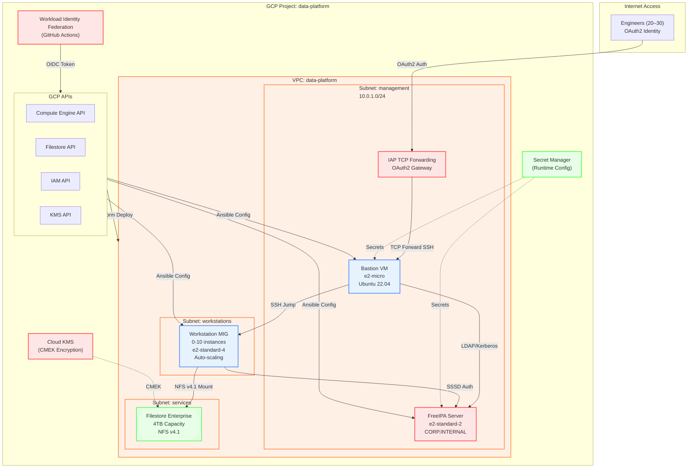

---

### Network Topology and Security

Detailed network architecture with security zones and firewall rules

---
- **VPC Design**: Single VPC with three purpose-built subnets
- **Firewall Strategy**: Deny-by-default with explicit allow rules
- **NAT Gateway**: Outbound internet access for package updates
- **Private Google Access**: GCP API access without public IPs
- **Network Security**: Internal traffic flows with minimal external exposure

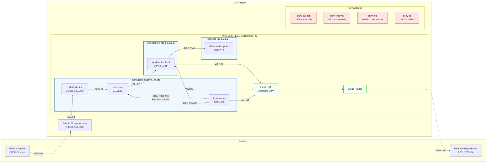

---

### Authentication and Authorization Flow

Complete authentication sequence from user login to resource access

---
- **Identity Provider**: Google OAuth2 for initial authentication
- **Central Directory**: FreeIPA LDAP for user accounts and groups
- **Session Management**: Kerberos tickets for SSO across platform
- **Access Control**: Group-based permissions with principle of least privilege
- **Audit Trail**: Complete logging of authentication and authorization events

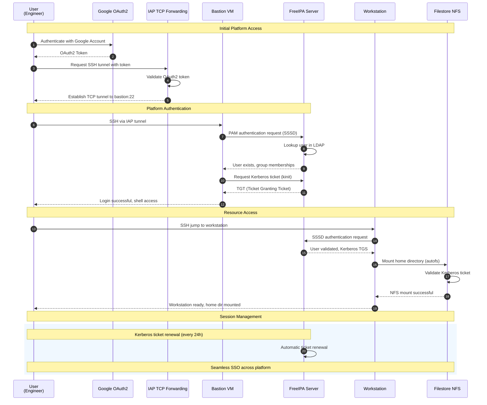

---

---
## Infrastructure Components
---

### Compute Architecture

Detailed compute resource design and scaling strategy

---
- **Bastion Configuration**: Single e2-micro instance for secure access
- **FreeIPA Sizing**: e2-standard-2 for LDAP/Kerberos services
- **Workstation Fleet**: Auto-scaling MIG supporting 0-10 concurrent users
- **Performance Targets**: Support for 20-30 engineers with peak usage patterns
- **Cost Optimization**: Scale-to-zero capability during off-hours

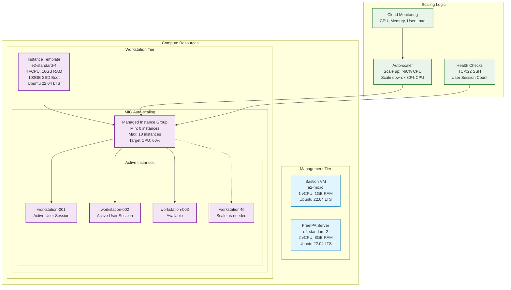

---

### Storage Architecture

Comprehensive storage design with performance and capacity planning

---
- **Filestore Enterprise**: High-performance NFS for user home directories
- **Capacity Planning**: 4TB total (2TB home + 2TB shared) supporting 30 users
- **Performance Specs**: 1000 IOPS, 100 MB/s throughput per TB
- **Backup Strategy**: Daily snapshots with 30-day retention
- **Access Patterns**: Optimized for development workloads and collaboration

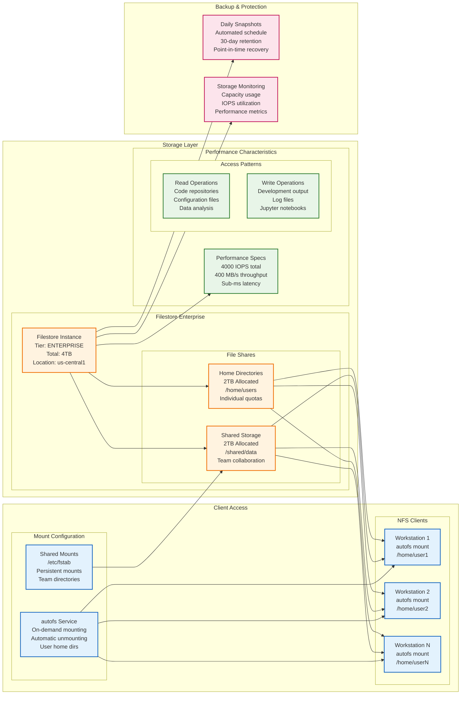

---

---
## Security Model
---

### Security Architecture

Comprehensive security design with defense-in-depth approach

---
- **Zero Trust Network**: No trust assumptions, verify every access request
- **Defense in Depth**: Multiple security layers with different controls
- **Principle of Least Privilege**: Minimal required permissions only
- **Encryption Everywhere**: Data at rest, in transit, and in processing
- **Audit and Compliance**: Complete activity logging and monitoring

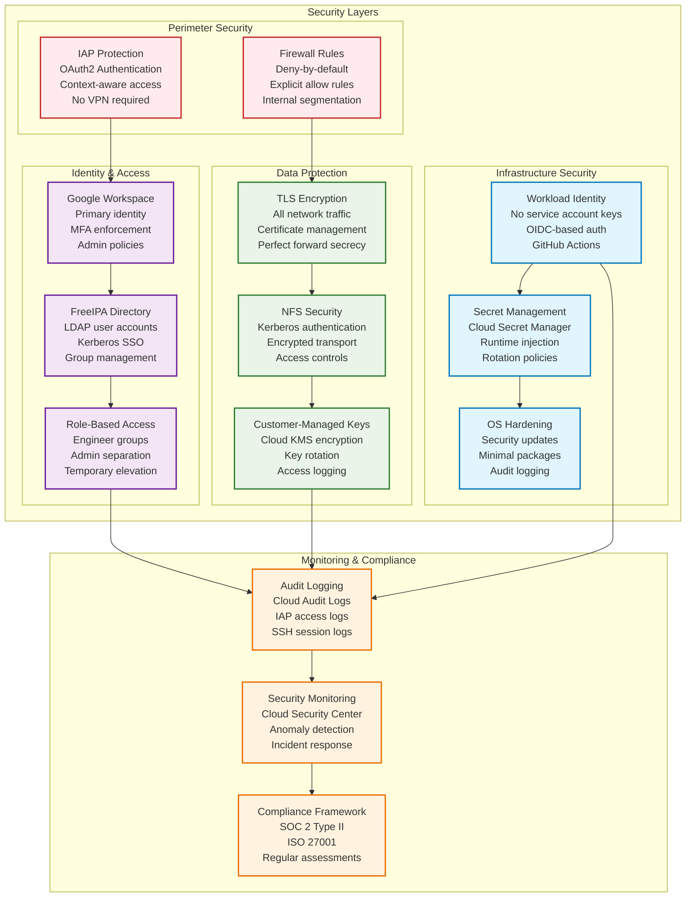

---

### Threat Model and Mitigations

Security threat analysis and corresponding mitigation strategies

---
- **External Threats**: Internet-based attacks, credential theft, social engineering
- **Internal Threats**: Privilege escalation, data exfiltration, insider threats
- **Infrastructure Threats**: Service outages, configuration drift, supply chain attacks
- **Data Threats**: Unauthorized access, data corruption, compliance violations

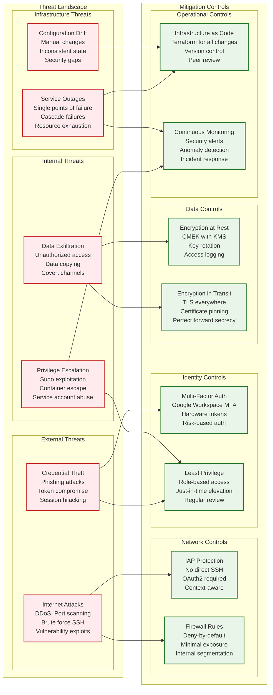

---

---
## Deployment Architecture
---

### Deployment Pipeline

Complete CI/CD pipeline architecture with GitOps workflow

---
- **Source Control**: GitHub repository with branch protection
- **CI/CD Platform**: GitHub Actions with Workload Identity Federation
- **Infrastructure as Code**: Terraform for resource provisioning
- **Configuration Management**: Ansible for system configuration
- **Deployment Strategy**: Phased rollout with validation gates

```mermaid
graph LR
    subgraph "Source Control"
        GIT["GitHub Repository<br/>Infrastructure code<br/>Ansible playbooks<br/>Documentation"]
        
        subgraph "Branch Strategy"
            MAIN["main branch<br/>Production code<br/>Protected branch<br/>Required reviews"]
            DEV["development<br/>Feature branches<br/>Testing changes<br/>Integration testing"]
        end
    end
    
    subgraph "CI/CD Pipeline"
        subgraph "GitHub Actions"
            TRIGGER["Workflow Triggers<br/>Push to main<br/>Pull requests<br/>Manual dispatch"]
            
            subgraph "Pipeline Stages"
                VALIDATE["Validation Stage<br/>Terraform validate<br/>Ansible lint<br/>Security scan"]
                PLAN["Planning Stage<br/>Terraform plan<br/>Change review<br/>Cost estimation"]
                DEPLOY["Deployment Stage<br/>Terraform apply<br/>Ansible execution<br/>Validation tests"]
            end
        end
        
        subgraph "Authentication"
            WIF_AUTH["Workload Identity<br/>OIDC tokens<br/>No service keys<br/>Temporary credentials"]
            GCP_AUTH["GCP Authentication<br/>Project-level access<br/>Least privilege<br/>Audit logging"]
        end
    end
    
    subgraph "Target Environment"
        subgraph "Infrastructure Layer"
            TF["Terraform State<br/>Remote backend<br/>State locking<br/>Version tracking"]
            GCP_INFRA["GCP Infrastructure<br/>VPC, VMs, Storage<br/>Managed services<br/>Security policies"]
        end
        
        subgraph "Configuration Layer"
            ANSIBLE["Ansible Execution<br/>Host configuration<br/>Service setup<br/>User management"]
            INVENTORY["Dynamic Inventory<br/>GCP plugin<br/>Auto-discovery<br/>Group assignment"]
        end
    end
    
    GIT --> TRIGGER
    MAIN --> TRIGGER
    DEV --> TRIGGER
    
    TRIGGER --> VALIDATE
    VALIDATE --> PLAN
    PLAN --> DEPLOY
    
    DEPLOY --> WIF_AUTH
    WIF_AUTH --> GCP_AUTH
    GCP_AUTH --> TF
    GCP_AUTH --> ANSIBLE
    
    TF --> GCP_INFRA
    ANSIBLE --> INVENTORY
    INVENTORY --> GCP_INFRA
    
    classDef source fill:#f3e5f5,stroke:#7b1fa2,stroke-width:2px
    classDef pipeline fill:#e1f5fe,stroke:#0277bd,stroke-width:2px
    classDef auth fill:#fff3e0,stroke:#ef6c00,stroke-width:2px
    classDef target fill:#e8f5e8,stroke:#2e7d32,stroke-width:2px
    
    class GIT,MAIN,DEV source
    class TRIGGER,VALIDATE,PLAN,DEPLOY pipeline
    class WIF_AUTH,GCP_AUTH auth
    class TF,GCP_INFRA,ANSIBLE,INVENTORY target
```

---

### Multi-Phase Deployment Strategy

Detailed deployment phases with dependencies and validation checkpoints

---
- **Phase 0**: Foundation security and API enablement
- **Phase 1**: Core infrastructure provisioning
- **Phase 2**: Service configuration and integration
- **Phase 3**: Production hardening and monitoring
- **Phase 4**: User onboarding and documentation

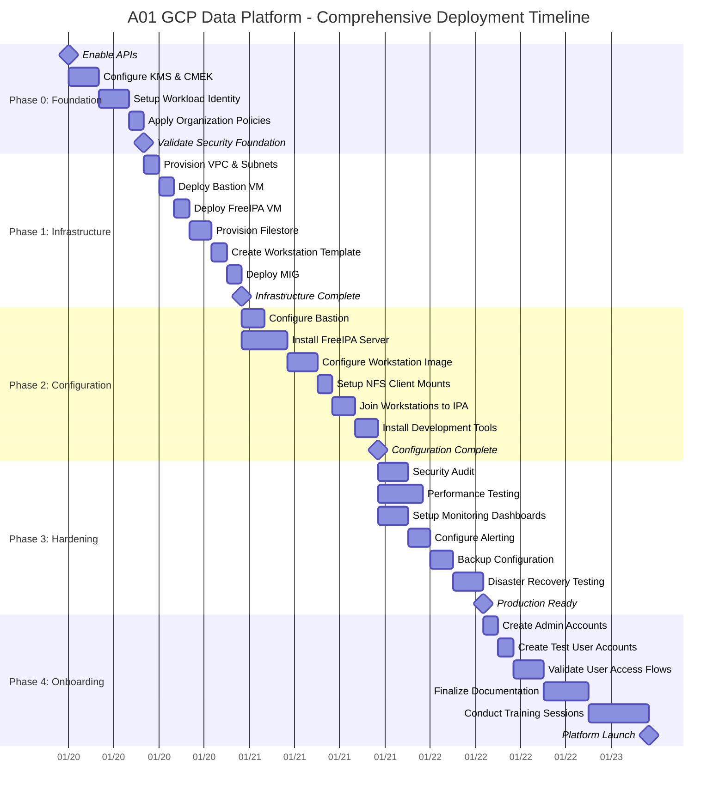

---

---
## Performance Architecture
---

### Performance Specifications

Detailed performance requirements and capacity planning for 20-30 engineers

---
- **User Capacity**: Support 20-30 concurrent engineers
- **Response Time**: <2 seconds for authentication, <1 second for file operations
- **Throughput**: Handle 1000+ file operations per minute
- **Availability**: 99.9% uptime SLA with 4-hour recovery time
- **Scalability**: Auto-scale workstations based on demand

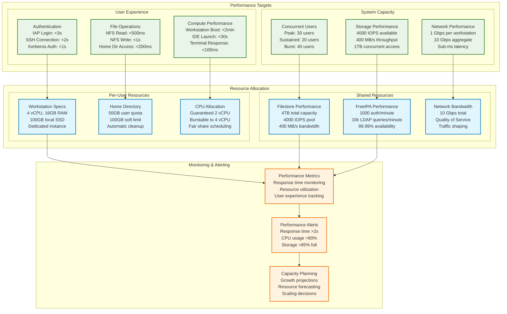

---

---
## Monitoring Architecture
---

### Comprehensive Monitoring Stack

Complete observability solution with metrics, logs, and alerts

---
- **Metrics Collection**: Cloud Monitoring with custom metrics from all components
- **Log Aggregation**: Cloud Logging with structured logs and correlation
- **Alerting Strategy**: Tiered alerts with escalation and on-call rotation
- **Dashboard Design**: Role-based dashboards for operators and executives
- **Incident Response**: Automated detection with manual escalation procedures

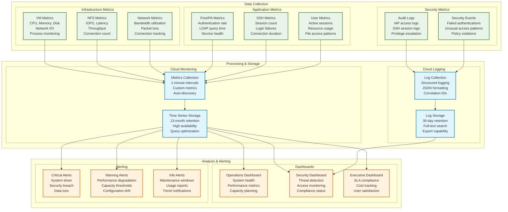

---

