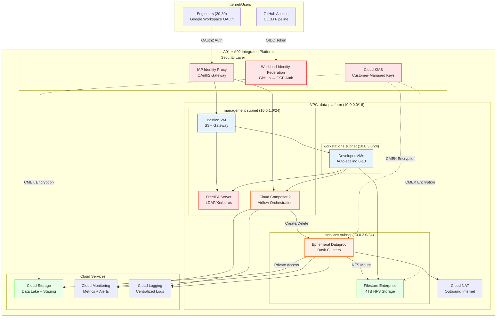
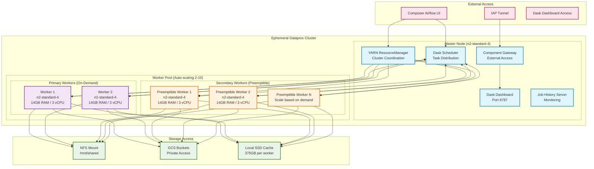
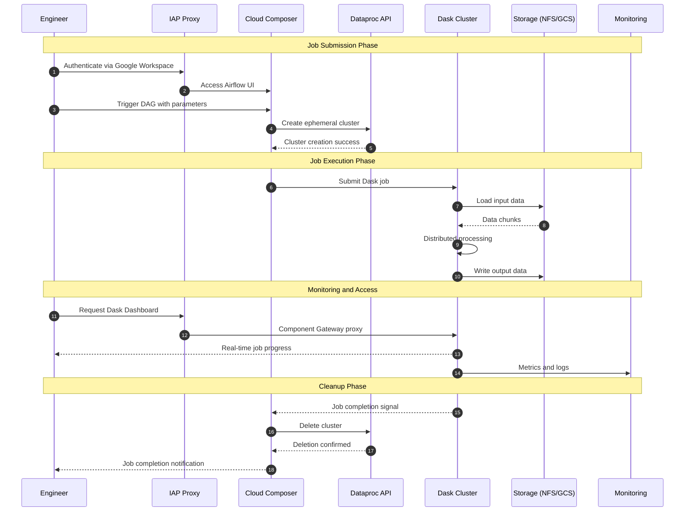
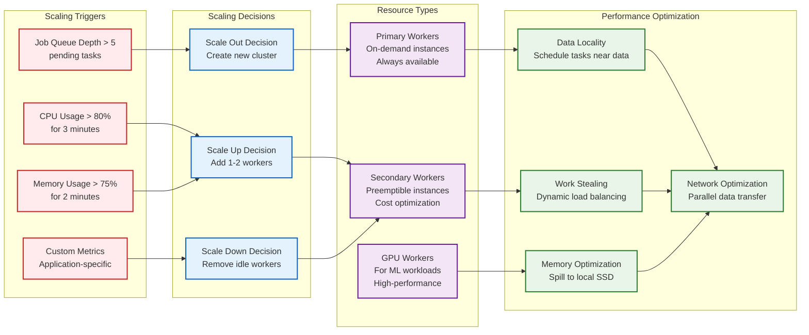

# A02 - Dask Cluster Architecture Diagrams

---
## System Architecture
---

### Complete Integration with A01 Platform

Comprehensive view of A02 Dask cluster integration with existing A01 infrastructure

---
- **Integration Strategy**: Seamless integration with existing A01 VPC, security, and identity
- **Network Isolation**: Private IP deployment with existing firewall and NAT configuration
- **Identity Reuse**: Leverages A01's IAP, FreeIPA, and WIF for unified access control
- **Storage Integration**: Access to both Filestore NFS and Cloud Storage

---

### Dask Cluster Internal Architecture

Detailed view of ephemeral Dataproc cluster with Dask framework

---
- **Cluster Composition**: Master node with scheduler + auto-scaling worker pool
- **Resource Management**: YARN integration with Dask distributed computing
- **Performance Optimization**: Optimized for 20-30 concurrent users
- **Cost Efficiency**: Ephemeral deployment with scale-to-zero capability

---

---
## Data Flow Architecture
---

### Job Execution Workflow

End-to-end data processing workflow from job submission to completion

---
- **Orchestration**: Airflow DAGs trigger ephemeral cluster creation
- **Job Submission**: Multiple pathways for submitting distributed Python jobs
- **Data Processing**: Efficient data movement between storage systems
- **Resource Cleanup**: Automatic cluster deletion after job completion

---

### Performance and Scaling Patterns

Resource scaling and performance optimization patterns

---
- **Auto-scaling Logic**: Dynamic worker allocation based on workload
- **Resource Optimization**: Efficient CPU, memory, and storage utilization
- **Cost Management**: Preemptible instances and ephemeral deployment
- **Performance Monitoring**: Real-time metrics driving optimization decisions

---

---
## Monitoring Architecture
---

### Comprehensive Observability Stack

Multi-layered monitoring with metrics, logs, and distributed tracing

---
- **Metrics Collection**: Cluster health, job performance, and resource utilization
- **Log Aggregation**: Centralized logging with correlation and analysis
- **Real-time Dashboards**: Custom visualizations for different stakeholder needs
- **Alerting Strategy**: Tiered alerts with escalation and on-call integration

```mermaid
graph TB
  subgraph "Data Sources"
    subgraph "Infrastructure Metrics"
      VM["VM Metrics<br/>CPU, Memory, Disk, Network"]
      Dataproc["Dataproc Metrics<br/>Cluster health, YARN"]
      Composer["Composer Metrics<br/>DAG success rate, queue"]
    end
    
    subgraph "Application Metrics"
      Dask["Dask Metrics<br/>Task execution, worker load"]
      Python["Python App Metrics<br/>Custom business metrics"]
      Jobs["Job Metrics<br/>Runtime, success rate"]
    end
    
    subgraph "Log Sources"
      SysLogs["System Logs<br/>OS, services, security"]
      AppLogs["Application Logs<br/>Dask, Python jobs"]
      AuditLogs["Audit Logs<br/>IAP, API calls"]
    end
  end
  
  subgraph "Collection and Processing"
    subgraph "Metrics Pipeline"
      CloudMon["Cloud Monitoring<br/>Metrics ingestion"]
      Prometheus["Prometheus<br/>Custom metrics"]
      Pushgateway["Pushgateway<br/>Batch job metrics"]
    end
    
    subgraph "Logging Pipeline"
      CloudLog["Cloud Logging<br/>Log aggregation"]
      Fluentd["Fluentd<br/>Log shipping"]
      LogParser["Log Parsing<br/>Structured data"]
    end
  end
  
  subgraph "Visualization and Alerting"
    subgraph "Dashboards"
      OpsDash["Operations Dashboard<br/>Infrastructure health"]
      UserDash["User Dashboard<br/>Job progress, queues"]
      ExecDash["Executive Dashboard<br/>Usage, costs, SLAs"]
    end
    
    subgraph "Alerting"
      Critical["Critical Alerts<br/>System down, job failures"]
      Warning["Warning Alerts<br/>Performance degradation"]
      Info["Info Alerts<br/>Capacity, usage trends"]
    end
  end
  
  VM --> CloudMon
  Dataproc --> CloudMon
  Composer --> CloudMon
  Dask --> Prometheus
  Python --> Prometheus
  Jobs --> Pushgateway
  
  SysLogs --> CloudLog
  AppLogs --> Fluentd
  AuditLogs --> CloudLog
  
  CloudMon --> OpsDash
  CloudMon --> UserDash
  CloudMon --> ExecDash
  Prometheus --> OpsDash
  Pushgateway --> UserDash
  
  CloudMon --> Critical
  CloudMon --> Warning
  Prometheus --> Warning
  CloudLog --> Info
  
  CloudLog --> OpsDash
  LogParser --> UserDash

  classDef source fill:#e8f5e8,stroke:#2e7d32,stroke-width:2px
  classDef collect fill:#e1f5fe,stroke:#0277bd,stroke-width:2px
  classDef visual fill:#f3e5f5,stroke:#7b1fa2,stroke-width:2px
  classDef alert fill:#fff3e0,stroke:#ef6c00,stroke-width:2px
  
  class VM,Dataproc,Composer,Dask,Python,Jobs,SysLogs,AppLogs,AuditLogs source
  class CloudMon,Prometheus,Pushgateway,CloudLog,Fluentd,LogParser collect
  class OpsDash,UserDash,ExecDash visual
  class Critical,Warning,Info alert
```

---

---
## Cost Optimization Architecture
---

### Multi-Tier Cost Management

Comprehensive cost optimization strategy with automated controls

---
- **Ephemeral Clusters**: Scale-to-zero capability eliminates idle costs
- **Instance Type Optimization**: Mix of on-demand and preemptible instances
- **Resource Right-Sizing**: Dynamic allocation based on workload requirements
- **Cost Monitoring**: Real-time cost tracking with budget alerts

```mermaid
graph TB
  subgraph "Cost Optimization Strategies"
    subgraph "Compute Optimization"
      Ephemeral["Ephemeral Clusters<br/>Auto-delete after jobs<br/>Zero idle costs"]
      Preemptible["Preemptible Instances<br/>70% cost savings<br/>Fault-tolerant jobs"]
      RightSize["Right-sizing<br/>Match resources to workload<br/>CPU/Memory optimization"]
    end
    
    subgraph "Storage Optimization"
      Lifecycle["Storage Lifecycle<br/>Auto-tier old data<br/>Delete temporary files"]
      Compression["Data Compression<br/>Reduce storage footprint<br/>Network transfer"]
      Dedup["Deduplication<br/>Eliminate redundant data<br/>Shared datasets"]
    end
    
    subgraph "Network Optimization"
      Regional["Regional Processing<br/>Minimize egress costs<br/>Data locality"]
      Caching["Data Caching<br/>Reduce repeated transfers<br/>Local SSD cache"]
      Compression2["Network Compression<br/>Reduce bandwidth usage<br/>Cost per GB"]
    end
  end
  
  subgraph "Cost Monitoring and Control"
    subgraph "Real-time Tracking"
      Usage["Usage Monitoring<br/>Resource consumption<br/>Per-user tracking"]
      Budgets["Budget Alerts<br/>Spending thresholds<br/>Automated notifications"]
      Forecasting["Cost Forecasting<br/>Predictive modeling<br/>Capacity planning"]
    end
    
    subgraph "Automated Controls"
      AutoScale["Auto-scaling Policies<br/>Scale down idle resources<br/>Schedule-based scaling"]
      Quotas["Resource Quotas<br/>Per-user limits<br/>Team allocations"]
      Approval["Approval Workflows<br/>Large resource requests<br/>Cost governance"]
    end
  end
  
  subgraph "Cost Allocation"
    subgraph "Chargeback Model"
      UserCosts["User-level Costs<br/>Individual usage tracking<br/>Transparent billing"]
      ProjectCosts["Project-level Costs<br/>Team budget allocation<br/>Cost centers"]
      Optimization["Optimization Recommendations<br/>Cost reduction suggestions<br/>Automated actions"]
    end
  end
  
  Ephemeral --> Usage
  Preemptible --> Usage
  RightSize --> Budgets
  
  Lifecycle --> Forecasting
  Compression --> AutoScale
  Dedup --> Quotas
  
  Regional --> Approval
  Caching --> UserCosts
  Compression2 --> ProjectCosts
  
  Usage --> UserCosts
  Budgets --> ProjectCosts
  Forecasting --> Optimization
  
  AutoScale --> Optimization
  Quotas --> Optimization
  Approval --> Optimization

  classDef compute fill:#e3f2fd,stroke:#1565c0,stroke-width:2px
  classDef storage fill:#e8f5e8,stroke:#2e7d32,stroke-width:2px
  classDef network fill:#fff3e0,stroke:#ef6c00,stroke-width:2px
  classDef monitor fill:#f3e5f5,stroke:#7b1fa2,stroke-width:2px
  classDef control fill:#ffebee,stroke:#c62828,stroke-width:2px
  classDef allocate fill:#e0f2f1,stroke:#00695c,stroke-width:2px
  
  class Ephemeral,Preemptible,RightSize compute
  class Lifecycle,Compression,Dedup storage
  class Regional,Caching,Compression2 network
  class Usage,Budgets,Forecasting monitor
  class AutoScale,Quotas,Approval control
  class UserCosts,ProjectCosts,Optimization allocate
```

---

---
## Developer Workflow Architecture
---

### End-to-End Development Experience

Complete developer workflow from code to production deployment

---
- **Development Environment**: Integrated development with existing A01 workstations
- **Job Development**: Local development with seamless scaling to distributed execution
- **Git Integration**: Automated deployment of DAGs and job code
- **Monitoring Access**: Real-time visibility into job execution and performance

```mermaid
flowchart LR
  subgraph "Development Phase"
    Local["Local Development<br/>A01 Workstations<br/>Dask local mode"]
    Test["Local Testing<br/>Small datasets<br/>Algorithm validation"]
    Commit["Git Commit<br/>Code + DAGs<br/>Version control"]
  end
  
  subgraph "CI/CD Pipeline"
    PR["Pull Request<br/>Code review<br/>Automated testing"]
    Build["Build & Test<br/>Unit tests<br/>Integration tests"]
    Deploy["Deploy to Staging<br/>Composer DAG sync<br/>Job validation"]
  end
  
  subgraph "Production Execution"
    Trigger["Job Trigger<br/>Scheduled or manual<br/>Composer UI"]
    Scale["Auto-scaling<br/>Ephemeral clusters<br/>Resource allocation"]
    Execute["Distributed Execution<br/>Dask framework<br/>Parallel processing"]
  end
  
  subgraph "Monitoring & Feedback"
    Monitor["Real-time Monitoring<br/>Dask dashboard<br/>Performance metrics"]
    Logs["Log Analysis<br/>Error tracking<br/>Debug information"]
    Optimize["Performance Optimization<br/>Resource tuning<br/>Cost analysis"]
  end
  
  Local --> Test
  Test --> Commit
  Commit --> PR
  PR --> Build
  Build --> Deploy
  Deploy --> Trigger
  Trigger --> Scale
  Scale --> Execute
  Execute --> Monitor
  Monitor --> Logs
  Logs --> Optimize
  Optimize --> Local

  classDef dev fill:#e8f5e8,stroke:#2e7d32,stroke-width:2px
  classDef cicd fill:#e1f5fe,stroke:#0277bd,stroke-width:2px
  classDef prod fill:#f3e5f5,stroke:#7b1fa2,stroke-width:2px
  classDef monitor fill:#fff3e0,stroke:#ef6c00,stroke-width:2px
  
  class Local,Test,Commit dev
  class PR,Build,Deploy cicd
  class Trigger,Scale,Execute prod
  class Monitor,Logs,Optimize monitor
```

---

