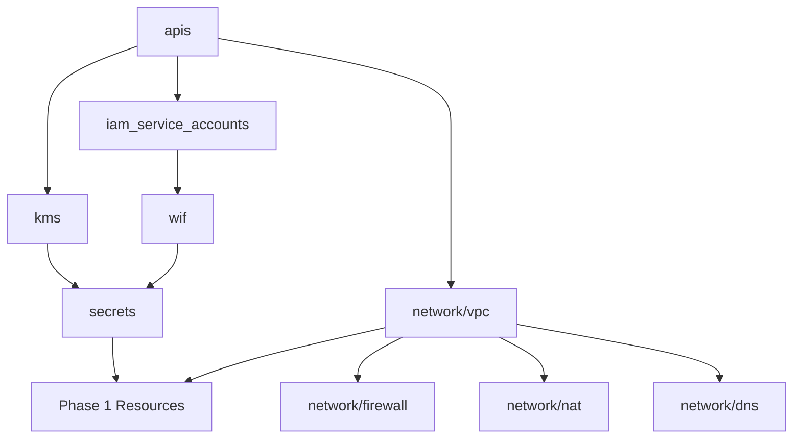

# ADR-002: Terraform Module Structure

**Status:** Implemented  
**Date:** 2025-01-15  
**Decision Makers:** Platform Engineering Team  

## Context

Need a maintainable Terraform structure for a complex GCP data platform with multiple components:
- Foundation services (APIs, IAM, networking, security)
- Compute resources (VMs, instance templates, MIGs)
- Storage services (Filestore NFS)
- DNS and access control

## Decision

Implement a **hierarchical module structure** with clear separation of concerns:

### Module Organization
```
terraform/
├── modules/                    # Reusable components
│   ├── apis/                   # GCP API enablement
│   ├── iam_service_accounts/   # Service account creation
│   ├── wif/                    # Workload Identity Federation
│   ├── kms/                    # Customer-managed encryption
│   ├── secrets/                # Secret Manager with CMEK
│   ├── network/                # Network components
│   │   ├── vpc/                # VPC and subnets
│   │   ├── firewall/           # Security rules
│   │   ├── nat/                # Cloud NAT
│   │   └── dns/                # Private DNS zones
│   ├── bastion/                # Bastion host VM
│   ├── freeipa_vm/            # FreeIPA server VM
│   ├── filestore/             # NFS storage
│   ├── instance_template_workstation/  # Workstation template
│   └── mig_workstation/       # Managed instance group
└── envs/                      # Environment-specific configs
    └── dev/                   # Development environment
        ├── main.tf            # Foundation orchestration
        ├── phase1.tf          # Phase 1 resources
        ├── variables.tf       # Foundation variables
        ├── variables.phase1.tf # Phase 1 variables
        ├── outputs.tf         # Cross-phase outputs
        └── backend.tf         # State management
```

### Module Design Principles

#### 1. Single Responsibility
Each module handles exactly one logical component:
- `modules/vpc/` - Only VPC and subnets
- `modules/firewall/` - Only firewall rules
- `modules/freeipa_vm/` - Only FreeIPA VM creation

#### 2. Clear Interfaces
All modules follow standard structure:
```
module/
├── main.tf        # Resource definitions
├── variables.tf   # Input parameters with types/descriptions
├── outputs.tf     # Resource IDs and computed values
└── README.md      # Usage documentation
```

#### 3. Explicit Dependencies
Use `depends_on` for proper ordering:
```hcl
module "secrets" {
  source = "../../modules/secrets"
  # ...
  depends_on = [module.kms, module.wif]
}
```

#### 4. Typed Variables
All variables include types and descriptions:
```hcl
variable "service_accounts" {
  description = "Service accounts to create"
  type = map(object({
    display_name = string
    roles        = list(string)
  }))
}
```

## Environment Structure

### Two-File Approach
- `main.tf`: Phase 0 foundation (APIs, networking, security)
- `phase1.tf`: Phase 1 compute resources (VMs, storage)

### Variable Organization
- `variables.tf`: Foundation configuration
- `variables.phase1.tf`: VM and service configuration

### Benefits
- Clear deployment phases
- Independent variable management
- Easier to understand and maintain

## Module Reusability

### Generic Modules
Modules like `network/vpc` and `iam_service_accounts` are reusable across projects:
```hcl
module "vpc" {
  source     = "../../modules/network/vpc"
  project_id = var.project_id
  vpc_name   = var.network.vpc_name
  subnets    = var.network.subnets
}
```

### Platform-Specific Modules
Modules like `freeipa_vm` are tailored for this data platform but still parameterized:
```hcl
module "freeipa" {
  source               = "../../modules/freeipa_vm"
  name                 = var.freeipa.name
  domain               = var.freeipa.domain
  # ... all configurable via variables
}
```

## State Management

### Remote State Backend
```hcl
terraform {
  backend "gcs" {
    bucket = "your-project-terraform-state"
    prefix = "envs/dev"
  }
}
```

### State Isolation
Each environment (dev/staging/prod) uses separate state files to prevent cross-environment conflicts.

## Rationale

### Maintainability
- Clear module boundaries reduce cognitive load
- Standard structure makes navigation predictable
- Documentation co-located with implementation

### Testability  
- Individual modules can be tested in isolation
- Environment separation enables safe experimentation

### Scalability
- New environments deploy by copying `envs/dev/` and updating variables
- Modules can be versioned and shared across teams

### Security
- Sensitive values handled via variables, never hardcoded
- State encrypted in GCS with proper IAM controls

## Implementation Details

### Module Dependencies


### Cross-Phase Outputs
Phase 0 provides structured outputs for Phase 1:
```hcl
output "phase_1_inputs" {
  value = {
    vpc_name              = module.vpc.vpc_name
    services_subnet_id    = module.vpc.subnets["services"].id
    workloads_subnet_id   = module.vpc.subnets["workloads"].id
    # ... all required Phase 1 inputs
  }
}
```

## Consequences

### Positive
- Clear separation of concerns
- Easy to understand and modify
- Reusable across environments
- Proper dependency management

### Negative
- More files to manage than monolithic approach
- Requires understanding of module interfaces

### Mitigation
- Comprehensive README files in each module
- Standardized variable naming conventions
- Example usage in environment configurations

## Validation

### Module Standards Checklist
- [ ] Variables have types and descriptions
- [ ] Outputs include descriptions
- [ ] README.md documents usage
- [ ] No hardcoded values
- [ ] Proper dependency declarations

### Deployment Testing
```bash
# Validate all modules
terraform validate

# Plan shows clean dependency resolution
terraform plan

# Apply works without manual intervention
terraform apply -auto-approve
```

This modular structure has been successfully implemented and supports the complete GCP data platform deployment.
