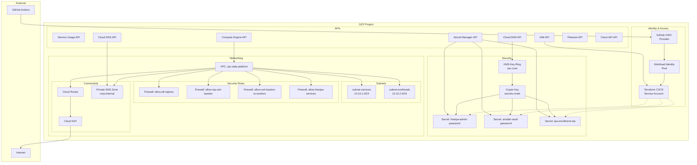

# GCP Data Platform - Phase 0 Foundation

This Terraform project creates the security and networking foundation for a VM-based GCP data platform. Phase 0 establishes the core infrastructure without VMs, preparing for Phase 1 deployment of FreeIPA, bastion hosts, and worker compute instances.

## Architecture Overview

The Phase 0 foundation implements a security-first approach with:

- **Zero long-lived service account keys** via Workload Identity Federation
- **Customer-managed encryption** for all secrets using Cloud KMS
- **Deny-by-default network posture** with explicit allow rules
- **Private-only compute instances** with Cloud NAT for egress
- **Centralized secret management** with fine-grained IAM

## Resource Diagram



## Apply Order

The Terraform configuration uses explicit dependencies to ensure proper sequencing:

1. **APIs** - Enable all required GCP services
2. **IAM & WIF** - Create service accounts and Workload Identity Federation  
3. **KMS** - Create key ring and crypto key for CMEK
4. **Secrets** - Create CMEK-encrypted secrets with IAM bindings
5. **Networking** - Create VPC, subnets, firewall rules, NAT, and DNS

All resources can be deployed in a single `terraform apply` due to proper dependency management.

## Quick Start

### Prerequisites

1. **GCP Project** with billing enabled
2. **GitHub Repository** for hosting this code
3. **Terraform** >= 1.6 installed locally
4. **gcloud CLI** authenticated with project access

### Initial Setup

1. **Clone and Configure**
   ```bash
   git clone <your-repo>
   cd terraform/envs/dev
   cp terraform.tfvars.example terraform.tfvars
   ```

2. **Update Configuration**
   Edit `terraform.tfvars`:
   ```hcl
   project_id = "your-gcp-project-id"
   region     = "us-central1"
   
   wif = {
     attribute_condition = "attribute.repository == \"your-org/your-repo\""
   }
   ```

3. **Bootstrap Terraform State** (Optional)
   ```bash
   # Create state bucket
   gsutil mb gs://your-project-terraform-state
   gsutil versioning set on gs://your-project-terraform-state
   
   # Update backend.tf with your bucket name
   # Then migrate state
   terraform init -migrate-state
   ```

4. **Deploy Foundation**
   ```bash
   terraform init
   terraform plan
   terraform apply
   ```

### GitHub Actions Setup

After successful deployment:

1. **Get WIF Configuration**
   ```bash
   terraform output wif_provider_name
   terraform output tf_cicd_service_account_email
   ```

2. **Configure GitHub Secrets**
   - `WIF_PROVIDER`: Output from `wif_provider_name`
   - `WIF_SERVICE_ACCOUNT`: Output from `tf_cicd_service_account_email`

3. **Enable Workflow**
   The included `.github/workflows/terraform.yml` will now work for:
   - Plan on pull requests
   - Apply on merge to main

## What's Deferred to Phase 1

Phase 0 creates the secure foundation. Phase 1 will add:

### Compute Resources
- **Bastion VM** with IAP access in `subnet-services`
- **FreeIPA Server VM** with static IP in `subnet-services`  
- **Worker VM Template** and Managed Instance Group in `subnet-workloads`

### Storage
- **Filestore NFS** instance with Enterprise/High Scale tier
- **NFS export configuration** with IP-based access controls

### Service Integration
- **DNS Records** for FreeIPA server and Filestore in private zone
- **FreeIPA DNS Forwarding** configuration in Cloud DNS (if using FreeIPA DNS)
- **Ansible Integration** using secrets from Secret Manager

### Example Phase 1 Additions
```hcl
# Add to terraform/envs/dev/main.tf after Phase 0

module "filestore" {
  source = "../../modules/filestore"
  # Uses outputs from Phase 0 VPC and subnets
}

module "compute_instances" {
  source = "../../modules/compute"  
  # Uses outputs from Phase 0 networking and secrets
}
```

## IAM Tightening (Post-Bootstrap)

The Terraform service account is granted broad permissions for initial bootstrapping. After Phase 0 deployment, reduce privileges:

### Remove Temporary Roles
```bash
# Remove admin roles, keep only operational ones
gcloud projects remove-iam-policy-binding PROJECT_ID \
  --member="serviceAccount:tf-cicd@PROJECT_ID.iam.gserviceaccount.com" \
  --role="roles/secretmanager.admin"

gcloud projects remove-iam-policy-binding PROJECT_ID \
  --member="serviceAccount:tf-cicd@PROJECT_ID.iam.gserviceaccount.com" \
  --role="roles/cloudkms.admin"
```

### Add Scoped Operational Roles
```bash
# Add resource-specific access
gcloud projects add-iam-policy-binding PROJECT_ID \
  --member="serviceAccount:tf-cicd@PROJECT_ID.iam.gserviceaccount.com" \
  --role="roles/secretmanager.secretAccessor"

gcloud projects add-iam-policy-binding PROJECT_ID \
  --member="serviceAccount:tf-cicd@PROJECT_ID.iam.gserviceaccount.com" \
  --role="roles/cloudkms.cryptoKeyEncrypterDecrypter"
```

### Recommended Final Roles
- `roles/compute.instanceAdmin` (for VM lifecycle in Phase 1)
- `roles/file.editor` (for Filestore management in Phase 1)
- `roles/secretmanager.secretAccessor` (read secrets only)
- `roles/cloudkms.cryptoKeyEncrypterDecrypter` (CMEK operations)
- `roles/dns.admin` (maintain private zones)

## Network Security Posture

### Firewall Rules Created

| Priority | Name | Direction | Source | Target | Ports | Purpose |
|----------|------|-----------|---------|---------|-------|---------|
| 65534 | deny-all-ingress | INGRESS | 0.0.0.0/0 | vm-managed | all | Baseline deny |
| 1000 | allow-iap-ssh-bastion | INGRESS | 35.235.240.0/20 | bastion | 22/tcp | IAP access |
| 1100 | allow-ssh-bastion-to-workers | INGRESS | bastion tag | worker tag | 22/tcp | Jump host |
| 1200 | allow-freeipa-services | INGRESS | 10.10.0.0/16 | freeipa tag | Multiple | Auth services |

### FreeIPA Service Ports
- **53/tcp,udp** - DNS (if FreeIPA DNS enabled)
- **88/tcp,udp** - Kerberos authentication  
- **389/tcp** - LDAP
- **443/tcp** - HTTPS web UI and enrollment
- **464/tcp,udp** - Kerberos password change
- **636/tcp** - LDAPS (secure LDAP)

### Egress Control
- All private instances use Cloud NAT for internet access
- No public IPs assigned to VMs (enforced by subnet config)
- Optional: Add restrictive egress rules to force traffic through NAT

## Troubleshooting

### Common Issues

**Terraform State Conflicts**
```bash
# If state gets corrupted
terraform import google_project_service.apis[\"iam.googleapis.com\"] PROJECT_ID/iam.googleapis.com
```

**WIF Authentication Failures**
```bash
# Test WIF configuration
gcloud iam workload-identity-pools providers describe github-provider \
  --location=global \
  --workload-identity-pool=github-pool
```

**API Enablement Delays** 
```bash
# Some APIs take time to propagate
terraform apply -refresh-only
terraform plan  # Should show no changes after APIs are fully enabled
```

### Validation Commands

**Verify Foundation Resources**
```bash
# Check VPC and subnets
gcloud compute networks list
gcloud compute networks subnets list --filter="region:us-central1"

# Check firewall rules
gcloud compute firewall-rules list --filter="network:vpc-data-platform"

# Check secrets
gcloud secrets list

# Check KMS
gcloud kms keyrings list --location=us-central1
```

## Module Documentation

Each module includes detailed README files:

- [`modules/apis/`](modules/apis/README.md) - GCP API enablement
- [`modules/iam_service_accounts/`](modules/iam_service_accounts/README.md) - Service account creation
- [`modules/wif/`](modules/wif/README.md) - Workload Identity Federation setup
- [`modules/kms/`](modules/kms/README.md) - Customer-managed encryption keys
- [`modules/secrets/`](modules/secrets/README.md) - Secret Manager with CMEK
- [`modules/network/vpc/`](modules/network/vpc/README.md) - VPC and subnets
- [`modules/network/firewall/`](modules/network/firewall/README.md) - Firewall rules
- [`modules/network/nat/`](modules/network/nat/README.md) - Cloud NAT configuration  
- [`modules/network/dns/`](modules/network/dns/README.md) - Private DNS zones

## Support

For issues with the Phase 0 foundation:

1. Check the troubleshooting section above
2. Review module-specific README files
3. Validate Terraform version compatibility (>= 1.6)
4. Ensure proper GCP project permissions for deployment
